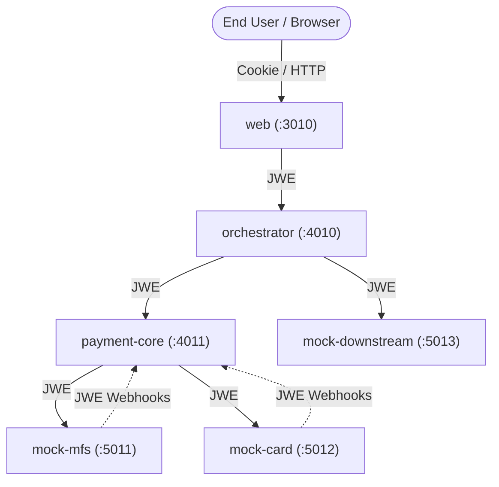

# System Context & Boundaries

## Service Boundaries
- **web (Port 3010)**: Next.js BFF + UI + Test Console. Server-side JWE signing/encryption.
- **orchestrator (Port 4010)**: Saga orchestrator. Defines journey steps, records attempts, handles retries.
- **payment-core (Port 4011)**: Payment domain authority. State transitions, double-entry ledger, outbox events, provider adapters.
- **mock-mfs (Port 5011)**: Simulates MFS PGW (bKash) with hosted PIN/OTP pages and webhooks.
- **mock-card (Port 5012)**: Simulates Card PGW with hosted forms, 3DS OTP, and tokenization.
- **mock-downstream (Port 5013)**: Simulates downstream recharge, cashback, and offer subscriptions.
